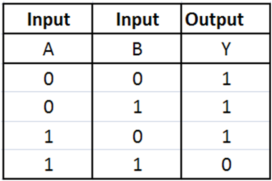

# Nand2tetris
This is a course about

# What I learn

# Project 1 

## Nand gate (provided)


## Not gate
 

```hdl
Nand(a=in, b=in, out=out);
```
## And gate 

```hdl
Nand(a=a, b=b, out=c);
Not(in=c, out=out);
```
## Or gate 

```hdl
Not(in=a, out=out1);
Not(in=b, out=out2)
Nand(a=out1, b=out2, out=out);
```
## Xor gate 

```hdl
Or(a=a, b=b, out=out1);
Nand(a=a,b=b,out=out2);
And(a=out1, b=out2, out=out);
```
## Mux gate  

Inputs: `a`, `b`, `sel`  
Outputs: `out`  
Function: If `sel=0` then `out=a` else `out=b`. 

```hdl
Not(in=sel, out=notsel);
And(a=notsel, b=a, out=a1); 
And(b=sel,b=b,out=b1); 
Or(a=a2, b=b1, out=out);
```
## DMux gate 

Inputs: `in`, `sel`
Outputs: `a`, `b`
Function: If `sel=0` then `a=in, b=0` else `a=0, b=in`.
```hdl
Not(in=sel, out=notsel);
And(a=notsel, b=in, out=a); 
And(b=sel,b=in,out=b);  
```
## 16-bit gate 
**(Just use the bit-wise gate and repeat on each single bit)**  
Not16 gate  
And16 gate  
Or16 gate  
Mux16 gate  
 
## Or8Way gate 
An n-way Or gate outputs 1 when at least one of its n bit inputs is 1 and 0 otherwise

```hdl
Or(a=in[0], b=in[1], out=out1);
Or(a=in[2], b=in[3], out=out2);
Or(a=in[4], b=in[5], out=out3);
Or(a=in[6], b=in[7], out=out4);

Or(a=out1, b=out2, out=out5);
Or(a=out3, b=out4, out=out6);

Or(a=out5, b=out6, out=out); 
```

## Mux4Way16 gate 
 

```hdl
Mux16(a=a, b=b, sel=sel[1], out=out1);
Mux16(a=c, b=d, sel=sel[1], out=out2);
Mux16(a=out1, b=out2, sel=sel[0], out=out[16])
```
## Mux8Way16 gate

```hdl
Mux4Way16(a=a, b=b, c=c, d=d, sel=sel[0..1], out=out1);
Mux4Way16(a=e, b=f, c=g, d=h, sel=sel[0..1], out=out2);
Mux16(a=out1, b=out2, sel=sel[2], out=out);
```
## DMux4Way gate 

 
```hdl
DMux(in=in, sel=sel[1], a=out1, b=out2);
DMux(in=out1, sel=sel[0], a=a, b=b);
DMux(in=out2, sel=sel[0], a=c, b=d);
```
## DMux8Way gate  

```hdl
DMux(in=in, sel=sel[2], a=out1, b=out2);
DMux4Way(in=out1, sel=sel[0..1], a=a, b=b, c=c, d=d);
DMux4Way(in=out2, sel=sel[0..1], a=e, b=f, c=g, d=h);
```